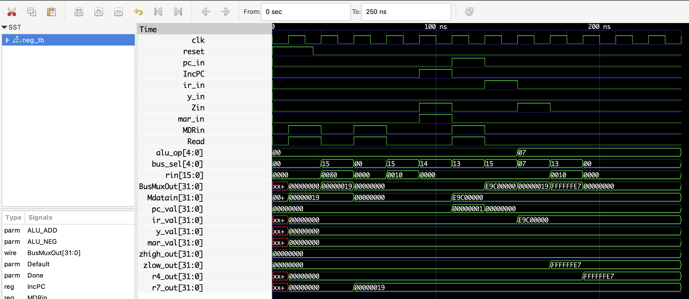
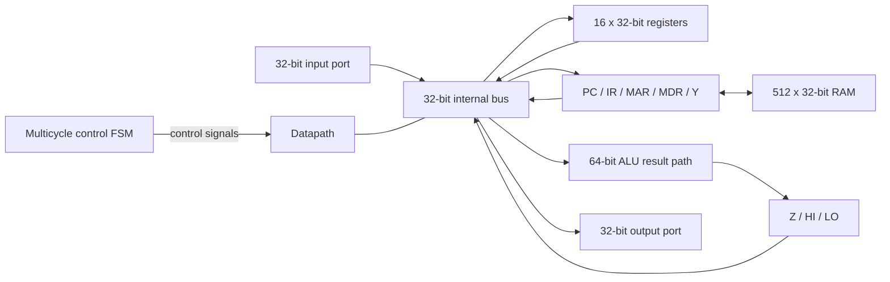

# Mini SRC CPU

[](https://github.com/ivanbard/ELEC374/actions/workflows/ci.yml)

A 32-bit, multicycle Mini SRC processor implemented in Verilog. The design combines a single-bus datapath, a finite-state control unit, a 28-instruction ISA, memory, and dedicated input/output ports. It can be simulated with Icarus Verilog and synthesized for the Intel DE0-CV FPGA board.



## Architecture



The processor fetches and executes one instruction across several clock cycles. Its FSM directly asserts the datapath control signals for each micro-operation.

### Highlights

- Sixteen 32-bit general-purpose registers plus `HI` and `LO`
- Arithmetic, logic, shifts, rotates, branching, jumps, load/store, and I/O
- Hand-built ripple-carry adder and five-stage barrel shifter
- Signed radix-4 Booth multiplier and non-restoring divider
- Parameterized RAM initialization for complete program simulations
- DE0-CV top level with synchronized keys, switches, LEDs, and hexadecimal displays

The full datapath, instruction set, and implementation tradeoffs are documented in [docs/design.md](docs/design.md).

## Verification

The public test target runs two self-checking programs and compiles the FPGA top level. A mismatch or timeout exits with a failure status.

| Check | Verified result |
| --- | --- |
| System program | 270 cycles, 44 instructions, CPI 6.023 |
| Accelerated I/O demo | 12,466 cycles, 2,168 instructions, CPI 5.748 |
| FPGA top-level compile | Passes with Icarus Verilog 12.0 |
| Quartus fit | Successful for Cyclone V `5CEBA4F23C7` |

Install [Icarus Verilog](https://steveicarus.github.io/iverilog/) and GNU Make, then run:

```sh
make test
```

Individual targets are available as `make test-p3`, `make test-p4`, and `make fpga-check`. GitHub Actions runs the same command for every push and pull request.

To generate and inspect the system-program waveform:

```sh
mkdir -p build
cd project
iverilog -g2012 -s cpu_tb -o ../build/cpu-p3.out -f project.f simulation/P3/cpu_tb.v
vvp ../build/cpu-p3.out
gtkwave cpu_tb.vcd output/P3/cpu_tb.gtkw
```

## FPGA target

Open `project/cpu_fpga.qpf` in Quartus Prime and compile the `cpu_fpga` top-level entity. The checked-in project targets the DE0-CV's Cyclone V `5CEBA4F23C7` device.

| Board resource | Function |
| --- | --- |
| `KEY0` | Reset and restart |
| `KEY1` | Stop execution |
| `SW[7:0]` | Low byte of the input port |
| `LEDR5` | CPU running indicator |
| `HEX1:HEX0` | Low byte of the output port |

With `SW[7:0]` set to `E0`, the demo program outputs `E0 70 38 1C 0E 07 03 01` five times, finishes at `63`, and halts.

The last recorded Quartus 25.1 Standard fit used 10,068 of 18,480 ALMs (54%), 17,262 registers, and 65 pins. These numbers document successful synthesis; a physical-board run is still the final hardware validation step.

## Repository layout

```text
project/
  rtl/                 processor and FPGA RTL
  simulation/P1/       datapath and ALU testbenches
  simulation/P2/       individual instruction testbenches
  simulation/P3/       complete system program
  simulation/P4/       FPGA I/O demonstration program
  output/P3, output/P4 GTKWave view configurations
  cpu_fpga.qpf/.qsf     Quartus project and board assignments
docs/
  design.md             architecture, ISA, and synthesis notes
Makefile                repeatable simulation and compile checks
```

## Scope and limitations

- The processor is multicycle rather than pipelined and has no caches or interrupts.
- RAM uses asynchronous reads; the recorded Quartus fit implemented it in logic instead of block RAM.
- The generic CPU boots the system image by default, while the FPGA top level selects the I/O demo image.
- Simulation and synthesis are automated. Physical DE0-CV validation is not claimed here.

## Credits

Developed as a Queen's University ELEC 374 team project by Ivan Bardziyan, Fedor Kim, and Nikhil Naran. The preserved original submission is tagged `course-submission`; this branch packages the same design for reproducible public review.
